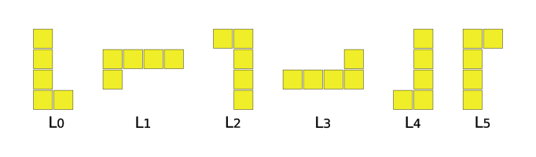
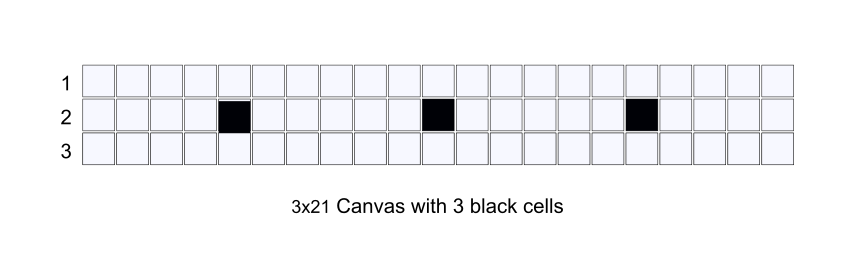

# Serres Hackathon 5.0 (2023) - The tile factory 1981


[Image source, dreamstime.com](https://www.dreamstime.com/production-line-ceramic-tiles-image138188770)

Suppose you work for a large factory making **decorative ceramic wall tiles** back in 1981!

You are member of the R&D team and you supervisors ask your team to find a way help the factory solve several problems.

The most urgent problem comes from an **old cutting machine** which produces many tile scraps with a "strange shape".

Your team have to find an **innovative way to sell these strange tiles** so the company doesn't have to throw them away or recycle them back.

Your team has only 42 hours to solve all the tasks is asked for! If you solve all the tasks you get **350pts** and win a salary increase!

## A. Programming

1] Create a function that can generate any 2d orthogonal Canvas in relative values (e.g. 12x4) divided with vertical and orthogonal lines into square cells.
Inside the Canvas there can be any black cells which are called "holes".


2] Create a function that **generates** all the 12 Shapes using the equivalent capital Letter of each Shape. See the image bellow:


3] Create a function that rotates (through its center) each Shape (if rotation makes sense) by 4 Angles (0 - default, 90, 180, 270) as also as flips it (reflect) by X or Y axis.
Notice that some Shapes can have 8 possible ways due to their missing symmetry.
For example the `L` Shape rotations and flipped versions can be provided like this:

```text
L0: L with no rotation (original)
L1: L rotated 90 degrees clockwise
L2: L rotated 180 degrees
L3: L rotated 270 degrees clockwise
L4: L flipped horizontally
L5: L flipped vertically
```



4] Create a function that locates a Shape (rotated/flipped etc) inside a Canvas on any **allowed positions**.
Example: Given a Canvas and a Shape on any option (e.g. `12x5` with `L1`, see Function from Q3) return  all the possible positions inside the Canvas this Shape option can be added on.


5] Create a function that counts the empty (unfilled) and filled cells of a Canvas that contains any Shapes. You should not count the black cells (holes).

6] Create a function that **represents in plain text** (in a single row) the position of all the Shapes inside a Canvas using the Shape letters.
Start your list from the top left corner of the Canvas.
Write the Letter that each cell is filled with.
Separate each line of the Canvas with a space.
Black holes can be represented by the capital Letter `B`.
Here is an example for a 5x5 Canvas filled with some Shapes:


```text
# Solution for the 5x5 Canvas above
FFLLΙ YFFLΙ ΥFTLΙ ΥΥTLΙ ΥΤΤΤΙ
```

7] Create a function that combines 2 different Shapes together so you create a `Congruent Group` or in short a `Group`.
The 2 Shapes should touch on one or more sides and not overlap. The 2 Shapes should not "enclose" an empty cell. Here is an example:


8] Create a function that calculates the **Perimeter** of a Shape, of any Group or of any other larger Group (with more than 2 Shapes).


9] Create a function that calculates (in milliseconds, `ms`) the execution time of any other function.

10] Create a program that finds **each and every (unique) way to fill a Canvas** (with or without black cells) with the maximum number of Shapes given (with or without rotation and flipping allowed).

> Validation from range: **0,25,50,75,100%**. 100% validation gives **100pts** etc.

## B. Algorithms in practice

| No   | Points | Question/Task | Answer type | Your Answer |
| :--: | ------ | ---- | ---- | ---- |
| 1 | 5pt | Which is the minimal orthogonal Canvas cells (integer) needed to hold all the 12 Shapes without black cells inside?  | Integer |  |
| 2 | 5pt | What is the smallest Perimeter of a `Congruent Group`?  | Integer |  |
| 3 | 5pt | What is the largest Perimeter of a `Congruent Group`?  | Integer |  |
| 4 | 5pt | Which 2 Shapes can create a square `Congruent Group`?  | Letter list |  |
| 5 | 10pt | Which 2-Shape Groups look the same (on a 2d representation) with any other 2-Shape Group? | Letter list |  |
| 6 | 10pt | How many unique solutions can you find for a 3×20 Canvas? | Integer |  |
| 7 | 10pt | How many unique solutions can you find for a 5×3 Canvas? | Integer |  |
| 8 | 10pt | How many unique solutions can you find for a 4×15 Canvas? | Integer |  |
| 9 | 20pt | How many unique solutions can you find for a 3×21 Canvas with 3 black holes as seen on the image below?  | Integer |  |
| 10 | 20pt | Which Shapes can be put together to make a copy of the `P` Shape which is bigger from the original piece. Notice that you can still use letter `P` to create a larger `P`. | Letter list |  |

> **Total: 100pts**.

## C. Graphical User Interface (GUI)

Create a GUI that will use the functions above and represents the solutions on the screen.

It can be a web page, a program GUI, a console output or any other interface.

The GUI should be as much as possible operation-system agnostic.

- The user should be able to choose several options for the GUI such as:

| No   | Points | Question/Task |
| :--: | ------ | ------------- |
| 11 | 5pt  | The cell dimensions on the screen (eg 10x10px, small/medium/large etc) |
| 12 | 5pt  | The Canvas black holes positions |
| 13 | 5pt  | The Canvas dimensions (notice that you should be able to create any 2d Canvas) |
| 14 | 5pt  | The option to rotate and flip the Shapes or not. |
| 15 | 10pt | The Shapes to use for the solver (some of the 12 or all of them). |
| 16 | 20pt | Save every problem on a configuration file (txt, json, database entry etc) so the GUI can load it in the future. |

- The interface should be also able to:

| No   | Points | Question/Task |
| :--: | ------ | ------------- |
| 17 | 5pt | Display the time of execution for each solution. |
| 18 | 10pt | Display the colorized Shapes located on the Canvas. |
| 19 | 10pt | Display the number of unique solutions found every time. |
| 20 | 25pt | Display or download the full results (all combinations) of a solution as plain text as shown on the function No 6 of Section A. |

> **Total: 100pts**.

## D. Master questions (bonus)

| No   | Points | Question/Task | Answer type | Your Answer |
| :--: | ------ | ---- | ---- | ---- |
| 21 | 5pt | Which algorithm did you mainly used to solve the problem?  | Text |  |
| 22 | 5pt | For Q1, which are the width, height dimensions of the Canvas solutions you found?  | Array of x,y |  |
| 23 | 10pt | For Q2, how can you be certain that no other Perimeters could be made?  | Text |  |
| 24 | 15pt | Can you generate the "Tower of Thessaloniki" using all the 12 Shapes? | Letter list |  |
| 25 | 15pt | Can you generate a "symmetric butterfly" using all the 12 Shapes? | Letter list |  |

> **Total: 50pts**.

## Rules and instructions

- All the functions and coding should include meaningful comments above them.
- Two Shapes cannot overlap when located to the Canvas.
- A Shape cannot be used more than once in the same solution except if the Task says something different.
- You can rotate and flip the Shapes unless different mentioned.
- Shapes cannot be located out of a Canvas.
- Shapes cannot be located over a black hole on a Canvas.
- Not every solution needs all the 12 Shapes.
- An executable of the GUI considered an advantage.

Notice that the Hackathon [Requirements](https://hackathon.serrestech.gr/pages/requirements) and [Validation](https://hackathon.serrestech.gr/pages/validation) are always active and should be considered.

## Keywords

- backtracking algorithm
- depth-first traversal algorithm
- Exact Cover problem
- dancing links (DLX)
- Knuth's Algorithm X
- Brute force search
- Constraint programming
- Integer linear programming (ILP)
- Boolean satisfiability (SAT) solvers
- coordinates, matrix, grid, vector
- polyomino

## Tips and ideas

- Consider using an "anchor" Shape to start the positioning of the Shapes on the Canvas.
- Some Canvas positions should be disallowed for each Shape by default.
- You can solve a Canvas problem once and then try to replace or rearrange (rotate, swap, flip) Congruent Groups of Shapes by any means to find out more combinations.
- You can try fill a Canvas by starting filling its borders clockwise.
- You can represent the Shapes and Canvas as arrays, matrix, string etc.

## Questions, issues etc

- Please add your **questions** on https://github.com/serrestech/hackathon-topic/issues or use the [existing default Issue No1](https://github.com/serrestech/hackathon-topic/issues/1).

## Appendix

- Color codes by Shape (Letter):

```css
F: #001fc4
I: #9c1516
L: #efee29
N: #e719e2
P: #07d4f3
T: #8a8a8a
U: #00e53f
V: #f19a05
W: #d5d5d5
X: #2097b8
Y: #b82082
Z: #ff0011
```
