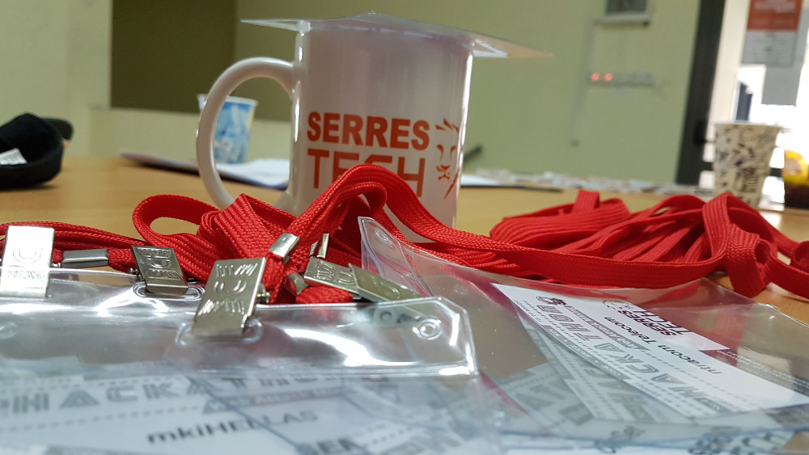

# Serres Hackathon 4.0 - After Post

## Ολοκληρώθηκε το 4o Ηackathon Serres 2019

Με επιτυχία ολοκληρώθηκε το [4o Serres Hackathon](http://hackathon.serrestech.gr)
 με θέμα «Web Attack Mining» το Σάββατο 18 και την Κυριακή 19 Μαΐου 2018 στο ΤΕΙ Κ.Μ. (Σέρρες) που διοργανώθηκε από την τεχνολογική κοινότητα Σερρών [serrestech.gr](https://www.serrestech.gr) και το [Πρόγραμμα Μεταπτυχιακών Σπουδών στην Εφαρμοσμένη Πληροφορική του Τμήματος Μηχανικών Πληροφορικής](http://informatics.teicm.gr/msc_informatics/) του ΤΕΙ Κεντρικής Μακεδονίας.

10 ομάδες και συνολικά 37 άτομα από το ΤΕΙ Κεντρικής Μακεδονίας, το Αλεξάνδρειο ΤΕΙ Θεσσαλονίκης, το ΠΑΜΑΚ και το Αριστοτελείο Πανεπιστήμιο διαγωνίστηκαν για 34 συνεχείς ώρες υλοποιώντας εφαρμογές ανοιχτού κώδικα οι οποίες σκοπό είχαν [να αναγνωρίσουν και να αναφέρουν επιθέσεις σε μια ιστοσελίδα](../README.md). Μάλιστα υπήρχε και διεθνής συμμετοχή με τον Burak Tamturk (Τουρκία).

Στους νικητές δόθηκαν χρηματικά έπαθλα καθώς και έκπτωση 25% στα δίδακτρα του Πρόγραμμα Μεταπτυχιακών Σπουδών στην Εφαρμοσμένη Πληροφορική. Όλοι οι συμμετέχοντες έλαβαν βεβαίωση συμμετοχής, μετάλλιο και μία αναμνηστική κούπα ενώ όλα τα αποτελέσματα δημοσιεύτηκαν στο [επίσημο website του Hackathon](http://hackathon.serrestech.gr)

Την πρώτη θέση κατέλαβε η ομάδα Wannabe Programmers, με δύο μέλη από το ΑΠΘ και το ΠΑΜΑΚ.

Με πολύ μικρή διαφορά (1 πόντο), δεύτερη ήρθε η ομάδα Πύθωνες, με τέσσερα μέλη, όλα από το ΤΕΙ Κεντρικής Μακεδονίας

Τρίτη ήρθε η ομάδα HACKBANG, με τέσσερα μέλη, από το ΠΑΜΑΚ

Τα πλήρη και αναλυτικά αποτελέσματα [είναι διαθέσιμα online](../results).

Την διοργάνωση υποστήριξαν η UNESCO Σερρών (Club UNESCO for Serres), πλήθος τοπικών και όχι μόνο εταιρειών, φορέων, μέσων μαζικής ενημέρωσης και εθελοντών. Τους ευχαριστούμε θερμά όλους για την υλική και έμπρακτη συμπαράσταση τους. Μια πλήρης λίστα όλων των χορηγών βρίσκεται στην [επίσημη σελίδα του hackathon](http://hackathon.serrestech.gr).

Σύμφωνα με τις δηλώσεις των συμμετεχόντων, το σημαντικότερο όφελος από την συμμετοχή τους στο Hackathon ήταν η αποκόμιση πλούσιας εμπειρίας αλλά και η επαφή με τους χορηγούς. Οι περισσότερες από τις ομάδες δήλωσαν ότι θα ήθελαν να πάρουν μέρος και την επόμενη χρονιά.

Στη διάρκεια της εκδήλωσης επίσης υπήρξαν διάφοροι διαγωνισμοί, και κληρώθηκαν στους νικητές εισιτήρια συμμετοχής σε συνέδρια καθώς και αναμνηστικά δώρα. Ευχαριστούμε όλο τον κόσμο και τον καλούμε για να ενημερώνετε για τις δράσεις μας να γίνει μέλος στην κοινότητα δηλώνοντας συμμετοχή στο [Σερραϊκό μας meetup](https://www.meetup.com/Serrai-Software-Development-Meetup/) ή στη [σελίδα μας στο Facebook](https://www.facebook.com/SerresTech/)
