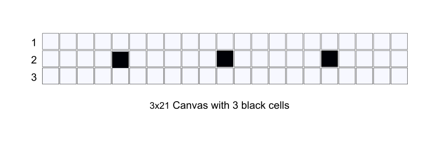

# Serres Hackathon 5.0 (2023) - Topic solution

> The topic of this year is about 5 square tiles named "pentominos".

## Questions and Tasks
### B. Algorithms in practice

| No   | Points | Question/Task | Answer type | Answer |
| :--: | ------ | ---- | ---- | ---- |
| 1 | 5pt | Which is the minimal orthogonal Canvas cells (integer) needed to hold all the 12 Shapes without black cells inside?  | Integer | 60 |
| 2 | 5pt | What is the smallest Perimeter of a Group?  | Integer | 14 |
| 3 | 5pt | What is the largest Perimeter of a Group?  | Integer | 22 |
| 4 | 5pt | Which 2 Shapes can create a square Group?  | Letter list | L0,P5 [image example](https://static.mathigon.org/cms/2aeb6180e05938d28d8659e07133617d.png) |
| 5 | 10pt | Which 2-Shape Groups look the same (on a 2d representation) with any other 2-Shape Group? | Letter list | [image](https://people.rit.edu/mecsma/Professional/Puzzles/Pentominoes/P-A%20Images/image21.gif) |
| 6 | 10pt | How many unique\* solutions can you find for a 3×20 Canvas? | Integer | 2, [source](https://isomerdesign.com/Pentomino/3x20/index.html) |
| 7 | 10pt | How many unique solutions can you find for a 5×3 Canvas? | Integer | 7, [source](https://isomerdesign.com/Pentomino/5x3/index.html) |
| 8 | 10pt | How many unique solutions can you find for a 4×15 Canvas? | Integer | 368, [source](https://isomerdesign.com/Pentomino/4x15/index.html) |
| 9 | 20pt | How many unique solutions can you find for a 3×21 Canvas with 3 black holes as seen on the image below?  | Integer | 6, [source](https://isomerdesign.com/Pentomino/3x21d) |
| 10 | 20pt | Which Shapes can be put together to make a copy of the P-shape which is bigger from the original piece. | Letter list | `ZVVV ZZZV NNZV PNNN PP PP` [image](https://people.rit.edu/mecsma/Professional/Puzzles/Pentominoes/P-A%20Images/image23.gif) |

\* Unique solutions: Where the answer is not a result of a simple rotation or flip of the whole (solved) canvas. If we do so all the answers provided here should be multiplied by number `4`.

> **Total: 100pts**.

### C. Graphical User Interface (GUI)

| No   | Points | Question/Task |
| :--: | ------ | ------------- |
| 11 | 5pt  | The cell dimensions on the screen (eg 10x10px, small/medium/large etc) |
| 12 | 5pt  | The Canvas black holes positions |
| 13 | 5pt  | The Canvas dimensions (notice that you should be able to create any 2d Canvas) |
| 14 | 5pt  | The option to rotate and flip the Shapes or not. |
| 15 | 10pt | The Shapes to use for the solver (some of the 12 or all of them). |
| 16 | 20pt | Save every problem on a configuration file (txt, json, database entry etc) so the GUI can load it in the future. |
| 17 | 5pt | Display the time of execution for each solution. |
| 18 | 10pt | Display the colorized Shapes located on the Canvas. |
| 19 | 10pt | Display the number of unique solutions found every time. |
| 20 | 25pt | Display or download the full results (all combinations) of a solution as plain text as shown on the function No 6 of Section A. |

> **Total: 100pts**.

### D. Master questions (bonus)

| No   | Points | Question/Task | Answer type | Answer |
| :--: | ------ | ---- | ---- | ---- |
| 21 | 5pt | Which algorithm did you mainly used to solve the problem?  | Text |  |
| 22 | 5pt | For Q1, which are the width, height dimensions of the Canvas solutions you found?  | Array of x,y | `4x15, 3x20, 5x12, 6x10` |
| 23 | 10pt | For Q2, how can you be certain that no other Perimeters could be made?  | Text | [example](https://mathigon.org/task/pentomino-perimeters) |
| 24 | 15pt | Can you generate the "Tower of Thessaloniki" using all the 12 Shapes? | Letter list | [image](http://www.mayhematics.com/d/d5z11.jpg) |
| 25 | 15pt | Can you generate a "symmetric butterfly" using all the 12 Shapes? | Letter list | [image](https://static.mathigon.org/cms/9f72086094ef665bcec8b61988499b73.png) |

> **Total: 50pts**.

## Resources

### About Pentomino

- https://en.wikipedia.org/wiki/Pentomino
- https://isomerdesign.com/Pentomino
- https://mathigon.org/task/pentomino-perimeters
- https://people.rit.edu/mecsma/Professional/Puzzles/Pentominoes/P-Intro.html
- http://www.ericharshbarger.org/pentominoes
- https://www.atarimagazines.com/compute/issue48/275_1_PENTOMINOS.php
- http://abasmith.co.uk/pentanomes/pentanomes.html

### Algorithms & papers

- https://en.wikipedia.org/wiki/Exact_cover
- https://en.wikipedia.org/wiki/Knuth%27s_Algorithm_X
- https://en.wikipedia.org/wiki/Dancing_Links
- https://en.wikipedia.org/wiki/Backtracking
- https://en.wikipedia.org/wiki/Boolean_satisfiability_problem
- [Solving Generalized Polyomino Puzzles Using the Ising Model, PDF, 2022](https://pdfs.semanticscholar.org/b5eb/f6d28ab1b25e6be59d302e5fe92262af5772.pdf)
- [Solving tiling puzzles with quantum annealing, PDF, 2019](https://arxiv.org/pdf/1904.01770.pdf)
- [Solving Pentomino Puzzles with Backtracking - Gabriel Nivasch, PDF, 2007](https://www.cs.brandeis.edu/~storer/JimPuzzles/PACK/Pentominoes/LINKS/PentominoesNivasch.pdf)
- [Dancing Links - Donald E. Knuth, Stanford University, PDF, 2000](https://arxiv.org/pdf/cs/0011047.pdf)

### Keywords

- **pentomino, pentominoes**
- polyomino, puzzle
- backtracking algorithm
- depth-first traversal algorithm
- Exact Cover problem
- dancing links (DLX)
- Knuth's Algorithm X
- Brute force search
- Constraint programming
- Integer linear programming (ILP)
- Boolean satisfiability (SAT) solvers
- coordinates, matrix, grid, table, vector
- symmetry
- elimination

### Tips and ideas

- Consider using an "anchor" Shape to start the positioning of the Shapes on the Canvas. The best Shape to become an anchor is the "X" letter.
- Some Canvas positions should be disallowed for each Shape by default.
- You can solve a Canvas problem once and then try to replace or rearrange (rotate, swap, flip) Congruent Groups of Shapes by any means to find out more combinations.
- You can try fill a Canvas by starting filling its borders clockwise.
- You can represent the Shapes and Canvas as arrays, matrix, string etc.
